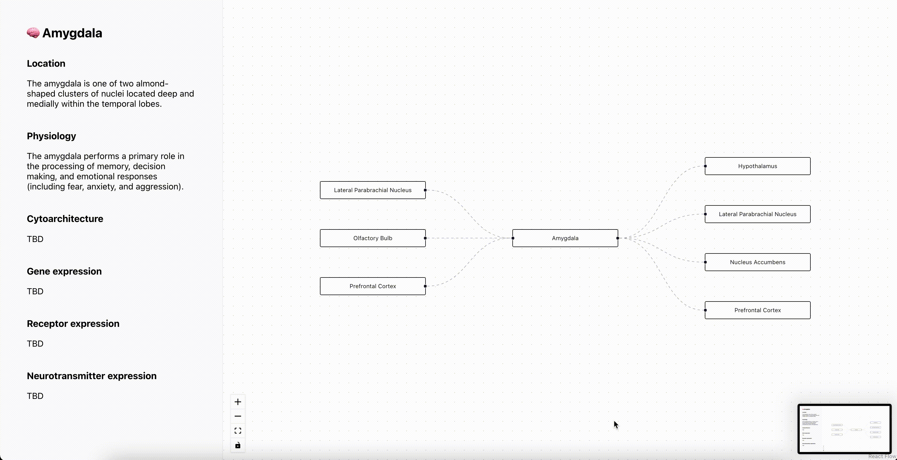

# kgraphflow
Visualization tools for knowledge graphs

## Demo video



## Installation

```sh
npm install
```

### Start Dev Server

```sh
npm start
```

Runs the app in development mode. Open [http://localhost:3000](http://localhost:3000) to view it in the browser.

### Run Tests

```sh
npm test
```

### Build

```sh
npm run build
```
